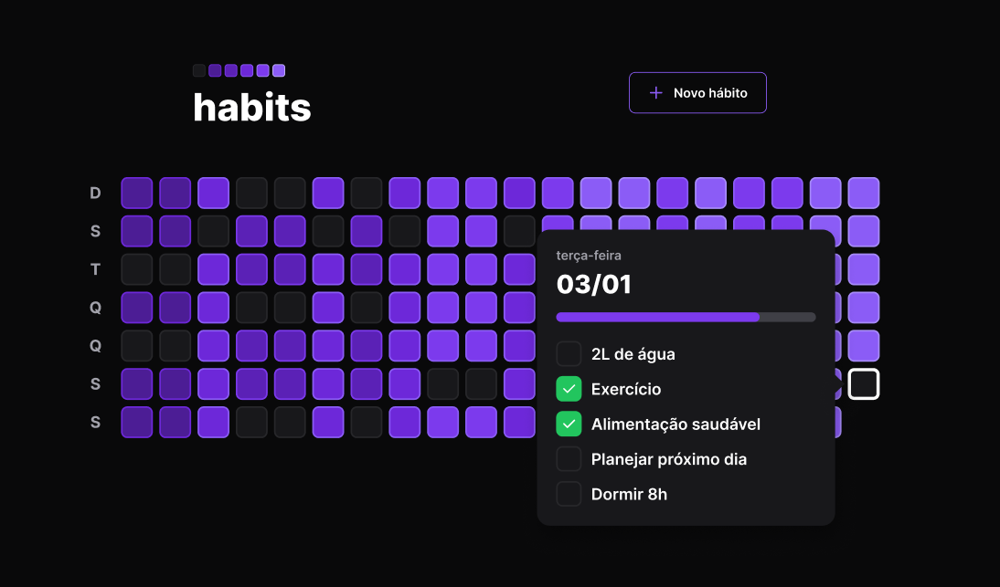

# HABITS

## ✨ Descrição do projeto

##### O projeto consiste em uma aplicação para o controle de hábitos de um usuário, utilizando as tecnologias mais atuais do mercado. Foi desenvolvido através do evento NLW Setup promovido pela RocketSeat.
&nbsp;

##### Funcionalidades 
- Listagem dos hábitos
- Responsividade
- Criação de hábitos e definição dos dias que eles serão aplicados.
- Marcação dos hábitos concluídos no dia
- Não deixa marcar um hábito retroativo
- Visualização com matriz de cores e barra de progresso para melhor identificação do usuário.
- Acessibilidade.
&nbsp;
________________________________
## 🛠 Tecnologias Utilizadas

### Front-End
- ReactJS
- Typescript
- Radix UI (acessibilidade)
- axios (conexão com a API)
- phosphor-react (icones)
- DayJs (manipulação de datas)
- TailwindCSS
- PostCSS /Autoprefixer
- Vite

### Back-End
- NodeJs
- Fastify
- Prisma ORM
- Typescript
- DayJS
- TSX
&nbsp;
________________________________
## 🎲 Rodando o projeto
##### Clone este repositório
$ git clone 

##### Instale as dependências
$ npm install

##### Execute a aplicação em modo de desenvolvimento (Funciona tanto no FRONTEND quanto no BACKEND)
$ npm run dev

##### O servidor inciará na porta:3333 - acesse <http://localhost:3333> 

##### O Projeto Frontend iniciará na porta 5173 - acesse <http://localhost:5173/>
&nbsp;
________________________________

## 🚀 Status do Projeto
##### Futuramente serão adicionadas Features de autenticação e outras melhorias
 #### 🚧 Em construção...  🚧

&nbsp;
________________________________

## ✅ Autora
#### Rayssa Santana
##### Linkedin: <https://www.linkedin.com/in/rayssa-mariana-s/>
#### Email: rayssa.marii23@gmail.com

